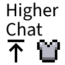

# Higher Chat

This is a Fabric mod for Minecraft that moves the chat above the armor bar.

## Q&A

### Will it move the chat even if my screen is wide enough for the chat and armor bar not to collide?

No. This mod automatically detects what bars appear on the same abscissa as the chat, and only takes those bars into account when computing the new position of the chat.

### What is the difference between this mod and [some other mod that does the same thing]?

Most similar mods only move the chat by a fixed amount, whereas this one decides on an optimal amount depending on your window width and how many bars are displayed.

### Is it compatible with mods that add other bars?

Probably not. Only vanilla bars are taken into account when computing how high the chat should be displayed.
